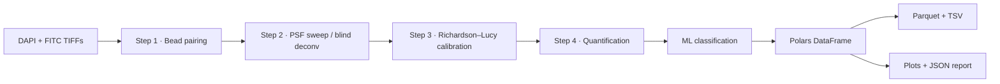

# 🔬 Cyclops

### *One eye on the field of view — direct sizing and counting of microbes in epifluorescence microscopy.*

<div align="center">


### 🧬 Tunable Blind Deconvolution • 📊 Polars Object Tables • 🖥️ Desktop GUI • 🚀 Parallelized Rust

</div>

---

# 🔭 What is Cyclops?

**Cyclops** is a high-performance, self-contained **Rust** tool that directly
**sizes and counts** particles in epifluorescence microscopy images:

* 🦠 Viral-like particles (VLPs)
* 🧫 Bacteria
* 🌡️ Archaea
* 🔬 Protists

It is a complete Rust rewrite of
[**EpiVirQuant**](https://github.com/raw-lab/EpiVirQuant) (Figueroa III,
Hollenack & White III) — preserving the scientific core *bit-for-bit* while
adding a desktop GUI, Polars-backed object tables, an ML organism classifier,
and a single statically-linked binary with **no Python environment to manage**.

Built for **speed**, **reproducibility**, and **publication-ready outputs**.

---

# ✨ Features

<table>
<tr>
<td width="50%">

## 🧬 Imaging & Deconvolution

* Tunable point-spread function (γ-sinc / Gaussian / hybrid)
* Blind-deconvolution MLE with automatic PSF sweep
* Richardson–Lucy calibration against DAPI microspheres
* Scale-bar bead pairing for pixel→nm calibration
* Otsu thresholding + region-property extraction
* Edge-artifact excision matching the reference pipeline

</td>
<td width="50%">

## 📊 Quantification & ML

* Per-object size, axes, eccentricity, intensity, area
* Six-band size breakdown (sub-viral → protist)
* ML organism classifier (rule-based + linfa GMM)
* Optional pure-Rust ONNX classifier backend
* Polars-backed Parquet **and** TSV object tables
* Seaborn-style plots via `plotters` (viridis ramp)

</td>
</tr>
</table>

---

# ⚡ Why Cyclops?

| Feature                                   | Cyclops |
| ----------------------------------------- | ------- |
| 🚀 Multi-threaded Rust core (`rayon`)     | ✅      |
| 🧬 Tunable blind-deconvolution PSF        | ✅      |
| 🖥️ Native desktop GUI (egui/eframe)        | ✅      |
| ⌨️ CLI matching every `epivirquant.py` flag | ✅      |
| 🧠 ML organism classification             | ✅      |
| 🤖 Optional ONNX backend (pure-Rust tract) | ✅      |
| ⚙️ Polars DataFrames (Parquet + TSV)       | ✅      |
| 📈 Live progress bar + per-image ticks    | ✅      |
| 📦 Single ~17 MB binary, no Python/NumPy  | ✅      |
| 🔒 Refuses to overwrite your input data   | ✅      |

---

# 🧱 Architecture



---

# 🦀 Tech Stack

| Component        | Technology            |
| ---------------- | --------------------- |
| Core engine      | Rust                  |
| Parallelism      | rayon                 |
| FFT / deconv     | rustfft + ndarray     |
| DataFrames       | polars                |
| Image I/O        | image + tiff          |
| Plotting         | plotters (viridis)    |
| Classical ML     | linfa (GMM)           |
| Deep-learning    | tract-onnx (optional) |
| CLI              | clap                  |
| Desktop GUI      | egui / eframe + rfd   |
| Error handling   | thiserror + anyhow    |

---

# 🚀 Installation

Cyclops is a **single crate** that ships a library plus two binaries
(`cyclops`, the CLI, and `cyclops-gui`, the desktop app). The GUI and the
optional ONNX backend are Cargo **features**, so a default install stays lean.

## 1️⃣ Install Rust

```bash
curl --proto '=https' --tlsv1.2 -sSf https://sh.rustup.rs | sh
rustup default stable
```

## 2️⃣ Install Cyclops

### From crates.io

```bash
cargo install cyclops                       # library + CLI (no heavy GUI deps)
cargo install cyclops --features gui        # + desktop GUI
cargo install cyclops --features "gui onnx" # + ONNX classifier backend
```

### From source

```bash
git clone https://github.com/raw-lab/cyclops
cd cyclops
cargo install --path .                      # CLI only
cargo install --path . --features gui       # CLI + GUI
```

| feature  | adds                                     | default? |
| -------- | ---------------------------------------- | -------- |
| *(none)* | library + `cyclops` CLI                  | ✅ on    |
| `gui`    | `cyclops-gui` desktop app (egui/eframe)  | off      |
| `onnx`   | pure-Rust ONNX classifier (tract)        | off      |

## 3️⃣ Linux GUI system libraries (only for `--features gui`)

| distribution            | install command |
| ----------------------- | --------------- |
| Debian / Ubuntu / Mint  | `sudo apt-get install -y pkg-config libgtk-3-dev libxkbcommon-dev libxcb1-dev libfontconfig1` |
| Fedora / RHEL / Rocky   | `sudo dnf install -y pkg-config gtk3-devel libxkbcommon-devel libxcb-devel fontconfig` |
| Arch / Manjaro          | `sudo pacman -S pkg-config gtk3 libxkbcommon libxcb fontconfig` |
| openSUSE                | `sudo zypper install pkg-config gtk3-devel libxkbcommon-devel libxcb-devel fontconfig` |

The CLI has **no system-library requirements** — only Rust.

---

# ⚡ Quick Start

## 🖥️ Desktop GUI

```bash
cyclops-gui        # built with --features gui
```

Point the **DAPI / FITC / Calibration / Output** fields at your data and click
**▶ Run Cyclops** — a live progress bar tracks each stage and per-image tick.
On WSL, launch via `./scripts/cyclops-gui-wsl.sh` (see [`docs/WSL.md`](docs/WSL.md)).

## ⌨️ Command line

```bash
cyclops \
    --dapi        data/GSL/tiff/dapi \
    --fitc        data/GSL/tiff/fitc \
    --calibration "data/GSL/tiff/dapi/GSL_+_blue_beads_1_(dapi).tiff" \
    --scaleLength 585 \
    --scaleMetric 20000 \
    --sphereSize  175 \
    --psfMethod   gam \
    --domains     virus,bacteria \
    --outDir      Cyclops_Output
```

> ⚠️ **Keep your output directory separate from your data.** Set `--outDir`
> (or the GUI Output field) to a folder that is **not** inside your DAPI/FITC
> folders. Cyclops refuses to run on overlapping paths so it can never
> overwrite your source images.

---

# 📦 Output Files

Cyclops writes the full EpiVirQuant artifact set plus modern Polars tables and
a machine-readable report.

```text
Cyclops_Output/
├── Step-1_VP/                    Bead-pair detection diagnostics
├── Step-2_Decon/
│   ├── PSF_final.png             The winning point-spread function
│   ├── deconLog.txt              Sweep summary (entropy, τ, v, filter size)
│   └── optimization/             Entropy-vs-iteration curves
├── Step-3_Corr/
│   ├── corrLog.txt               Per-image bead diameters → CORR factor
│   └── XB_SizeHistogram.png      Calibration size distribution
├── Step-4_genMasks/
│   ├── cyclops_objects.parquet   ← full per-object table (Polars)
│   ├── cyclops_objects.tsv       ← same, tab-separated
│   ├── sizeCoords.tsv            Legacy EpiVirQuant-compatible TSV
│   ├── XG_SizeHistogram.png      Sample size distribution
│   └── countLog.txt              Object counts + size-band breakdown
└── cyclops_report.json           Machine-readable run summary
```

The per-object table (`cyclops_objects.{parquet,tsv}`) columns:

| column          | meaning                                        |
| --------------- | ---------------------------------------------- |
| `file_name`     | source FITC image                              |
| `object_id`     | integer label within the image                 |
| `size_nm`       | equivalent diameter (or average axes)          |
| `axis_major_nm` / `axis_minor_nm` | semi-axes × 2 in nm          |
| `x_px` / `y_px` | centroid in pixels                             |
| `intensity`     | mean masked intensity                          |
| `eccentricity`  | region-props eccentricity                      |
| `area_px`       | pixel count                                    |
| `domain`        | `virus` / `bacteria` / `archaea` / `protist`   |
| `confidence`    | classifier posterior in [0, 1]                 |
| `dapi_fitc_ratio` | per-object intensity ratio                    |

Turn the tables into figures with the bundled plotter:

```bash
python scripts/make_figures.py Cyclops_Output Cyclops_Output/figures
```

---

# 🔬 How It Works

Cyclops keeps the four EpiVirQuant stages, orchestrated by
`cyclops_core::pipeline::run_pipeline`:

1. **Pair detection** — Otsu + 8-connected labelling locate every bead in the
   calibration scan; pairwise distance picks the closest valid VP pair.
2. **Blind-deconvolution PSF sweep** — `f_size × τ × v` swept with MLE blind
   deconvolution; the kernel with minimum image entropy wins. PSF family is
   **tunable** (`gam` / `gau` / `hyb`) and the sweep runs in parallel.
3. **Calibration** — Richardson–Lucy + region-props on DAPI microspheres yields
   the bead diameter; `CORR = sphere_size_nm / mean_measured_size`.
4. **Quantification** — FITC images are deconvolved with the same PSF,
   thresholded, labelled, and reported with diameter × axes × eccentricity ×
   intensity × area. False positives are pruned by eccentricity and a
   configurable `SM_constraint`.
5. **Classification** *(new)* — each object gets a domain call from a rule-based
   prior (size band + eccentricity + DAPI/FITC ratio), optionally refined by a
   linfa Gaussian Mixture Model, or scored by a user-supplied ONNX model.

---

# 🧪 Validation vs EpiVirQuant

On the published GSL dataset with identical parameters, Cyclops reproduces the
original Python pipeline:

| Metric              | EpiVirQuant (Python) | Cyclops (Rust) |
| ------------------- | -------------------- | -------------- |
| VP pair distance    | 457.9 nm             | **457.9 nm** (exact) |
| Mean particle size  | 181.5 nm             | 182.6 nm (**+0.6 %**) |
| Total object count  | 365                  | 376 (**+3.0 %**) |
| < 100 nm band       | 22                   | 22 (exact)     |

See [`docs/PYTHON_COMPARISON.md`](docs/PYTHON_COMPARISON.md) and
[`docs/BENCHMARK.md`](docs/BENCHMARK.md) for the full head-to-head and
timing/memory numbers.

---

# 📚 Library Usage

Cyclops can be embedded as a Rust crate (the library is `cyclops_core`):

```rust
use cyclops_core::{
    config::{Config, OrganismDomain, ClassifierConfig},
    pipeline::run_pipeline,
};

let cfg = Config {
    dapi_dir:    "data/dapi".into(),
    fitc_dir:    "data/fitc".into(),
    calibration: "data/dapi/blue_beads_1.tiff".into(),
    out_dir:     "Cyclops_Output".into(),
    classifier:  ClassifierConfig {
        domains: vec![OrganismDomain::Virus, OrganismDomain::Bacteria],
        gmm_refine: true,
        onnx_model: None,
    },
    ..Default::default()
};

let report = run_pipeline(&cfg)?;
println!("{} objects (mean {:.1} nm)", report.n_objects, report.mean_size_nm);
```

---

# 🧪 Testing

```bash
cargo test                       # library + integration tests
cargo test --features onnx       # include the ONNX backend tests
```

Covers:

* γ-sinc / Gaussian / hybrid PSF normalization
* Richardson–Lucy convergence on a known blur
* Otsu bimodal separation + morphological erosion
* Connected-component labelling
* NaN-safe classification (no object dropped)
* Per-image progress ticks
* **Data-safety guards** — refuses to overwrite input data
* End-to-end synthetic pipeline

---

# 📄 License

**Creative Commons Attribution-NonCommercial (CC BY-NC 4.0)** — identical to
upstream EpiVirQuant. Academic and non-commercial use is free; commercial
licensing inquiries → Richard Allen White III (`rwhit101@charlotte.edu`).
See the `LICENSE` file for details.

---

# 📖 Citation

If you use **Cyclops** in published work, please cite both the original
EpiVirQuant article and this software:

```text
Figueroa III JL, Hollenack SM, White III RAW.
Direct counting and sizing of viral-like particles by tunable
blind-deconvolution of epifluorescence microscopy.
BMC Methods 3:10, 2026.  https://doi.org/10.1186/s44330-026-00060-z

White III RAW, Figueroa III JL, Hollenack SM.
Cyclops: a Rust application for sizing and counting viral-like particles,
bacteria, archaea, and protists in epifluorescence microscopy. (in prep, 2026)
```

---

# 🤝 Contributing

We welcome:

* 🧬 New size/shape metrics and classifiers
* ⚡ Performance optimizations
* 📊 Visualization improvements
* 🤖 Trained ONNX models for organism classification
* 🦀 Rust ecosystem integrations

Pull requests and issues are encouraged.

---

# 📞 Support

* 🐛 **Issues:** [Cyclops Issues](https://github.com/raw-lab/cyclops/issues)
* 📧 **Contact:** [Dr. Richard Allen White III](mailto:rwhit101@charlotte.edu)

---

<div align="center">

# 🔬 Cyclops

### *Fast. Parallel. Reproducible microscopy quantification.*

Built with ❤️ in Rust by the [RAW Lab](https://www.rawlab.org).

</div>
